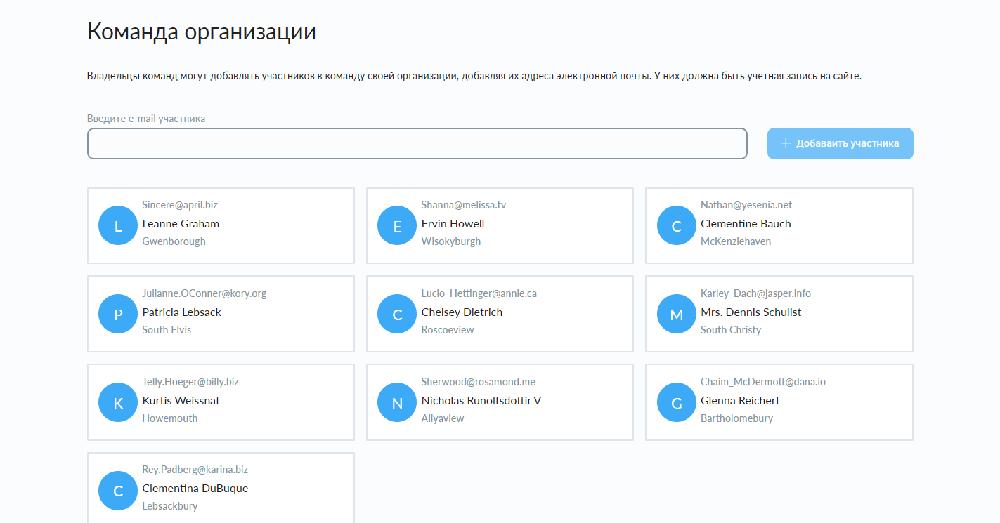
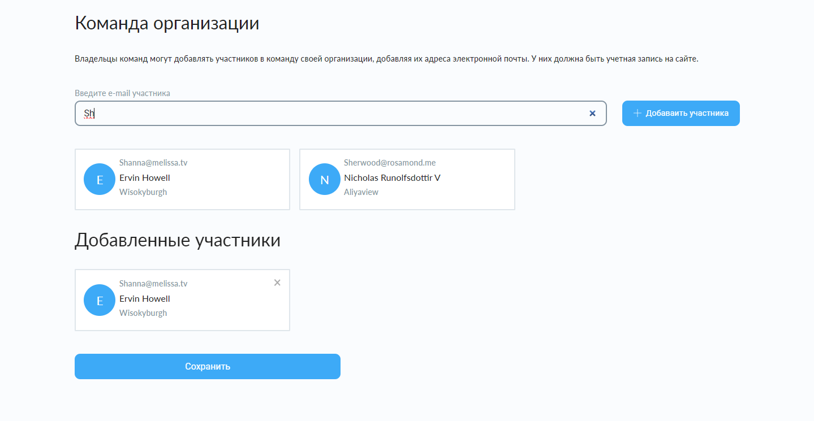

# Тестовое задание добавления пользователей по e-mail

Данное мобильное приложение выводит пользователей из базы данных (JSONPlaceholder api), и позволяет просматривать информацию о конкретном фильме.

## Требования

-   Вывод данных пользователей из сервера
-   Поиск пользователей по e-mail
-   При клике на пользователя заполнять поиск
-   Добавление участников организации

## Технологии

-   React
-   JSONPlaceholder API
-   TypeScript

## Скриншоты интерфейса

